# Session-Handler-Plus

The Session Handler Plus (SH+) Burp Suite extension offers enhanced session handling capabilities for JWTs, access tokens, refresh tokens, and CSRF tokens. Additionally, it allows for custom scripts to be launched through session handling actions, and facilitates the triggering of Selenium automation to execute complex or JavaScript based login procedures. 

**Main features of this extension:**

1. Get tokens from the response and store them in Burp Cookie Jar without the need for an additional request to get valid tokens. These tokens can be used in different places such as request headers, request body, with customizable formats like prefix, suffix, etc. from the GUI.

2. Provide additional session handling actions to delete all cookies from the cookie jar or only the collected tokens from the cookie jar. This is useful during ADFS login with different cookie names.

3. Run an external script through session handling actions. This is useful when the refresh token is expired and login needs to be performed through a web browser using Selenium webdriver and proxy traffic through Burp Proxy, so the token will be updated with new tokens.

4. Validate the request/response before reading the tokens to avoid processing unnecessary responses.

5. Store different applications' tokens with the combination of 'Shp-Path' request header and Burp cookie jar path. This helps when working with multiple APIs with the same structure but different authentication/refresh tokens.

#### Here is the screenshot:
<kbd>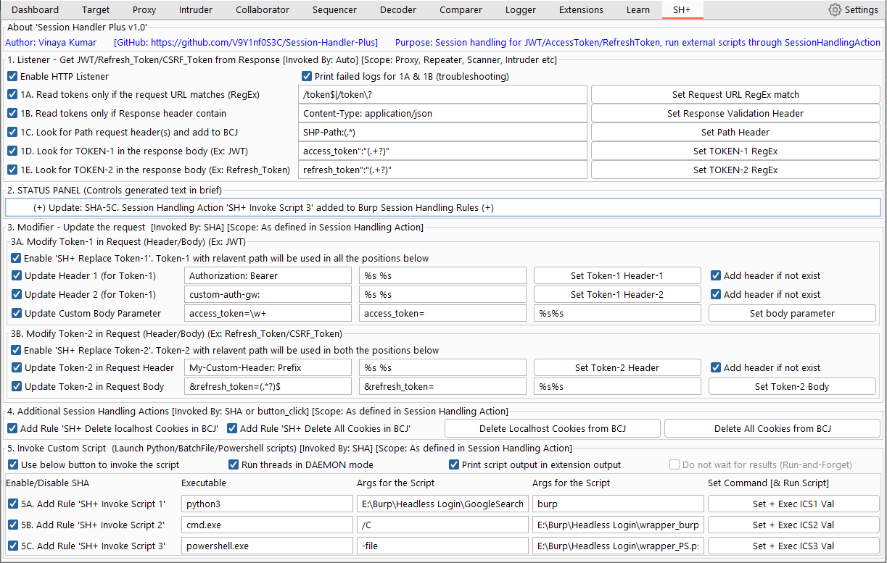</kbd>


## Sections:


### Section 1: Listen for Tokens
<kbd>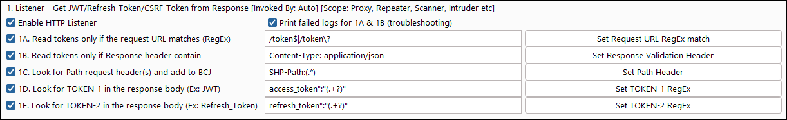</kbd>

This section 1 is focused on reading tokens from response and storing them in a cookie jar. To read tokens from response, the following criteria need to be met:

1A. The URL must match the RegEx criteria, otherwise the request/response is ignored and operation terminated.

1B. The request header must contain a specific string, otherwise the request/response is ignored and operation terminated.

1C. If the request header 'Shp-Path:' is available, the received tokens will be added to the cookies jar with this path. Otherwise, the '/' path will be selected.

1D. Read Token-1 from response, which can be considered as JWT in Angular Application/API terminology, and is obtained using RegEx.

1E. Read Token-2 from response, which can be considered as refresh_token in Angular Application or csrf_token in regular web applications, and is obtained using RegEx.

### Section 2: Status Panel
<kbd>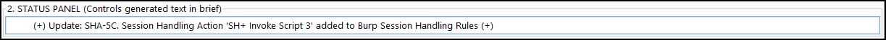</kbd>

The purpose of this section is to provide you with information about your actions. It displays the last action you performed, as well as any associated actions it may indicate.

### Section 3: Utilizing Tokens from Burp Cookie Jar in the Request.

<kbd></kbd>

This functionality is only available when using Session Handling Actions, which requires creating session handling rules and selecting this action.

1. Update Request Header/Body: The request header/body will be modified with Token-1/Token-2 obtained from the Cookie Jar.

2. Request Header to Search: If found, replace the existing token with the new token from the Cookie Jar.

3. String Replacement Indicator: This can be used to set prefix and suffix values along with the Cookie Jar tokens when replacing the header and new tokens.

4. Add Header if not Exist: When enabled, if the request doesn't have the header, a new header will be added with the latest token from the Cookie Jar. If this feature is disabled, the request without the request header will be ignored during modification.


### Section 4: Additional session handling actions for Burp cookie jar
<kbd>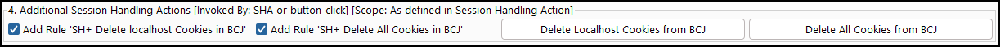</kbd>

1. A session handling action that allows you to delete the cookies stored in the cookie jar for localhost (the same cookies received in Section 1). This action can only be triggered by Burp session handling rules.

2. A session handling action that allows you to delete all cookies stored in the cookie jar. This action can only be triggered by Burp session handling rules.

3. A button that instantly deletes the cookies stored in the cookie jar for localhost.

4. A button that instantly deletes all cookies stored in the cookie jar.


### Section 5: Launching external scripts using session handling actions
<kbd>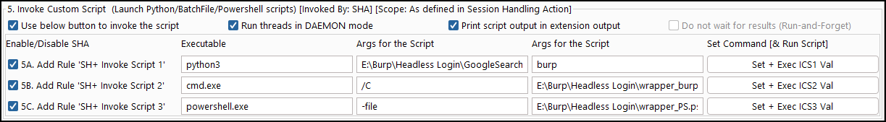</kbd>

1. Click the button below to run the script: This allows you to execute the script when the button is pressed, which is useful for troubleshooting.

2. Run threads in DEAMON mode: The external script is invoked with the thread.daemon='True' setting.

3. Print script output in the extension output: This prints the output of the script in the Burp extension output window, which is helpful for troubleshooting or status updates.

4. Do not wait for results (Run-and-Forget): By default, only 5 scripts (or threads) can be executed in parallel, and new threads will be rejected from execution. This feature is useful in case of misconfigured session handling actions that may invoke scripts for every request. When this option is selected, the maximum 5 thread limit restriction can be bypassed, allowing you to troubleshoot your scripts more effectively.


**About Section 5A/5B/5C:**

1. Enable the session handling action.

2. Specify the command to launch, such as python3, cmd, or powershell.
3. Provide arguments for the script.

4. Provide additional arguments for the script.

5. Set values and execute the script immediately. Useful for troubleshooting.


## SH+ in action

1. Screenshot showing the Section-1 in action:
<kbd>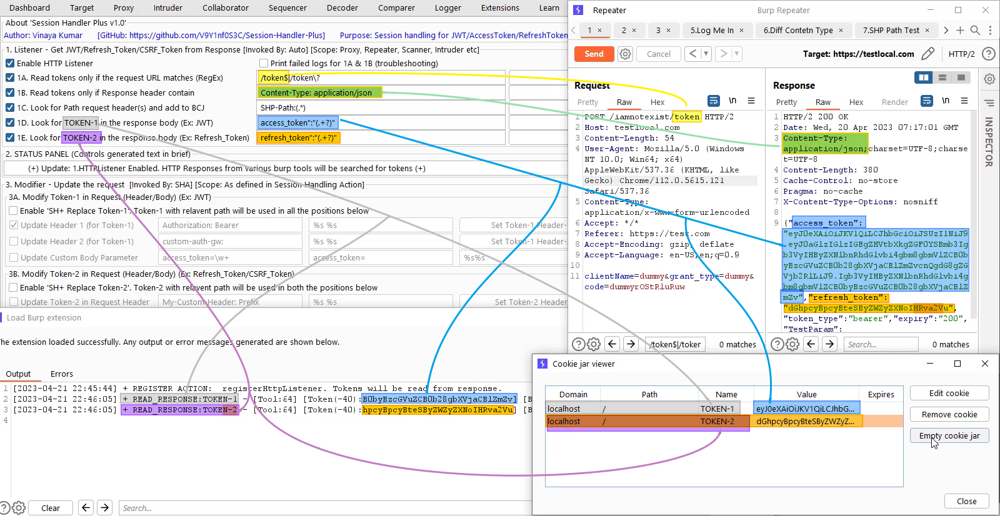</kbd>


2. Screenshot showing the list of session handling actions in Section-3,4,5:
<kbd>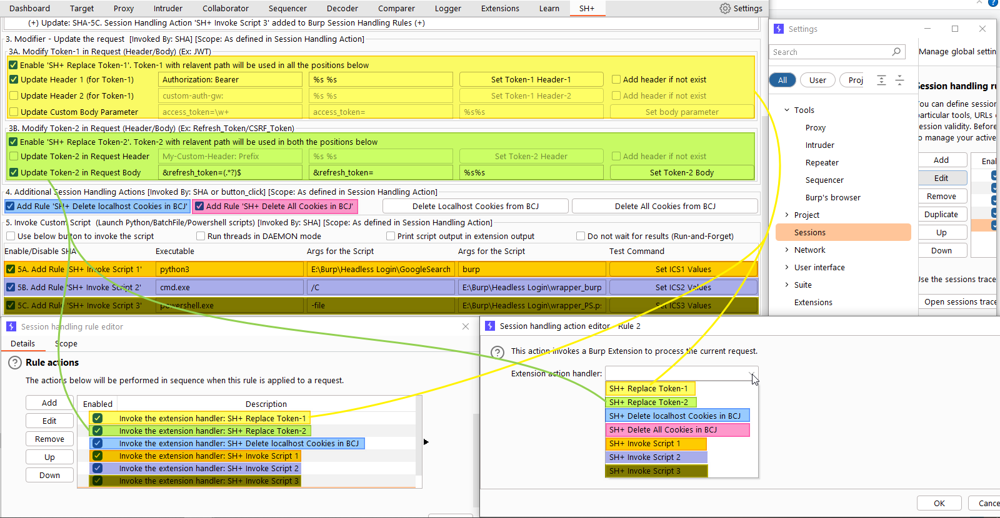</kbd>

3. Screenshot showing the Token-1 is read from Cookie jar and updated in the request header (Section-3A in action):
<kbd>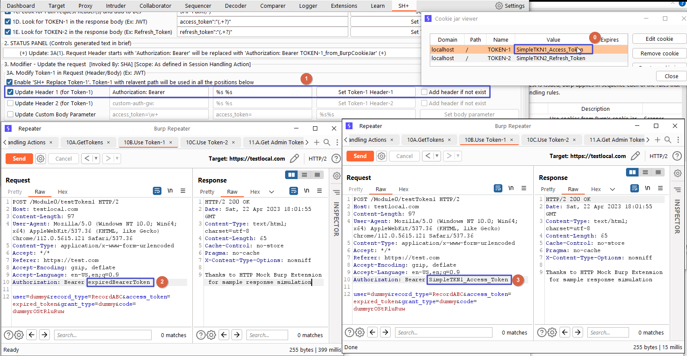</kbd>
**Note:** These are not detailed steps. Session handling rules need to be configured to see use this output. Screenshot is edited to show how was the initial request (left side) and how is the SH+ modified request (right side).

4. Screenshot showing the Token-2 is read from Cookie jar and updated in the request header (Section-3B in action):
<kbd>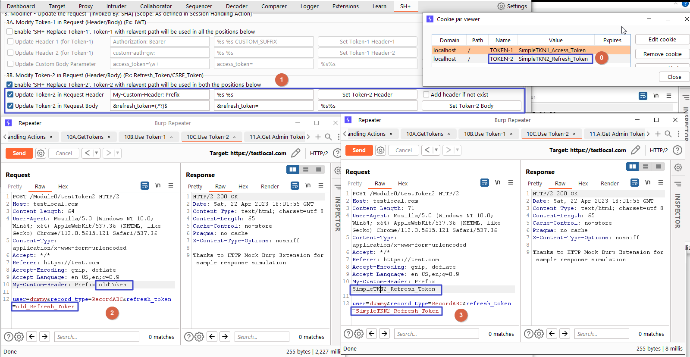</kbd>
**Note:** These are not detailed steps. Session handling rules need to be configured to see use this output. Screenshot is edited to show how was the initial request (left side) and how is the SH+ modified request (right side).


5. Screenshot showing how the external script paths can be configured:
<kbd>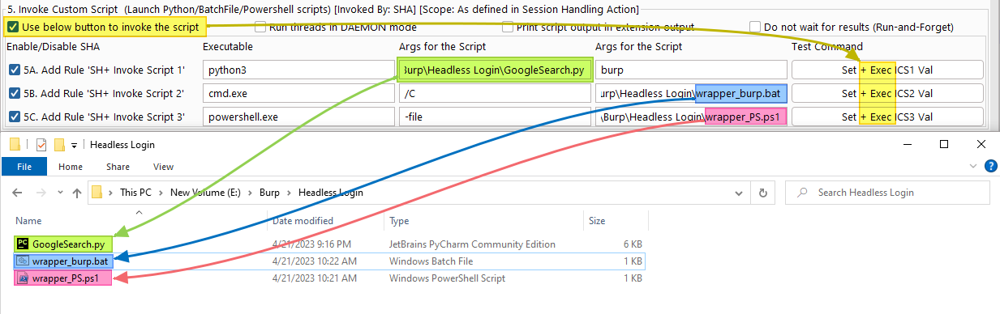</kbd>

6. Screenshot showing the external script output is printed displayed ((Section-5A in action):
<kbd>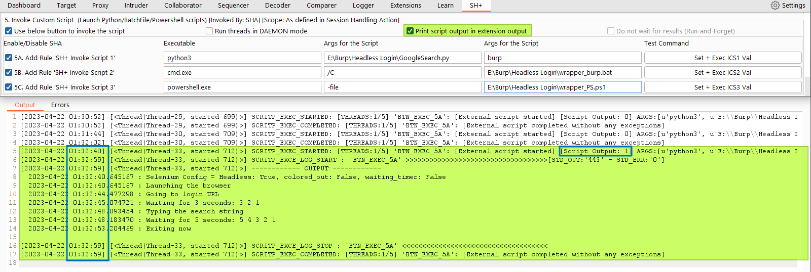</kbd>

## Demo:

### Working with one application (Section-1 & Section 3):

#### Steps:
```
Steps for simple usage of Token-1 & Token-2
-------------------------------------------
Read Token-1 & Token-2:
	1.Get the token using "1.Listener"

Using Token-1:
	2.Configure the SH+ extension settings for Token-1
	3.Setup the Session Handling Action to perform action
	4.Test if the Token-1 is read from Burp Cookie Jar
		*Check Req Header "Authorization: Bearer"
		*Check Req Header "Authorization: Bearer" with "Add header if not exist" case
		*Check Req Header "Authorization: Bearer" with CUSTOM_SUFFIX
		*Check Req Header "custom-auth-gw:"
		*Check Req Body "access_token=\w+"

Using Token-2:
	4.Configure the SH+ extension settings for Token-2
	5.Setup the Session Handling Action to perform action
	6.Test if the Token-2 is read from Burp Cookie Jar
		*Check Req Header "My-Custom-Header: Prefix"
		*Check Req Body "&refresh_token=(.*?)$"
```

#### Video:

[](https://www.youtube.com/watch?v=2vjhKZMKqco)


### Working with multiple applications/tokens (Section-1 & Section 3):
#### Steps:
```
Steps for using Token-1 & Token-2 for different portals/applications
--------------------------------------------------------------------
Read Token-1 & Token-2:
	1.Get the token using "1.Listener"
	2.Enable 1C for "SHP-Path:" requet header feature
	3.Generate the tokens for different applications
		*Get admin tokens for
			/Module1/Admin/
			/Module1/Management/
		
		*Get HR Tokens for 
			/Module2/HR/
		
		*Get Employee Tokens for 
			/Module3/Employee/

Using Token-1 (Same proess for Token-2):
	2.Configure the SH+ extension settings for Token-1
	3.Setup the Session Handling Action to perform action 
		URL Scope: https://testlocal.com/module
	4.Test if the Token-1 is read from Burp Cookie Jar
		*Check if Admin token is able to fetch TOKEN-1 for
			/Module1/Admin/userDetails
			/Module1/Management/deleteUserDetails
			
		*Check if HR token is able to fetch TOKEN-1 for
			/Module2/HR/loginToPayroll
			
		*Check if Employee token is able to fetch TOKEN-1 for
			/Module3/Employee/checkMyPaySlip
			
```

#### Video:

[](https://www.youtube.com/watch?v=0zRph3K8LWw)


#### Screenshots:

1. Screenshot showing the Tokens are read from response and added to cookie jar (Section-1 in action):
<kbd>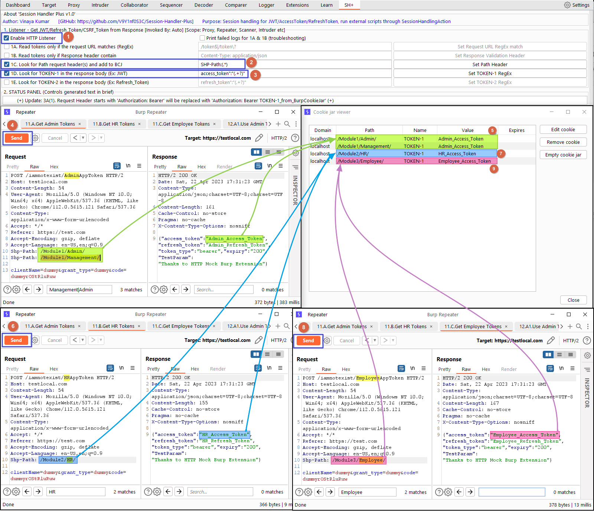</kbd>
**Note:** Screenshot is edited to show how tool works for multiple applications with diff paths.

2. Screenshot showing the Tokens are read from cookie jar and updated in request (Section-3 in action):
<kbd>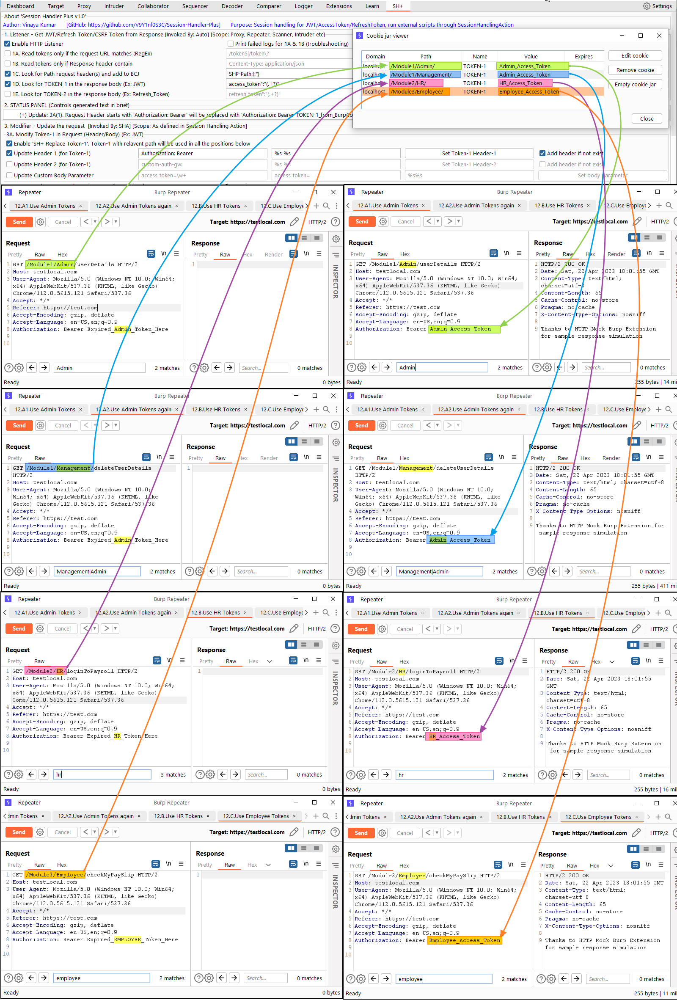</kbd>
**Note:** These are not detailed steps. Session handling rules need to be configured to see use this output. Screenshot is edited to show how was the initial request (left side) and how is the SH+ modified request (right side).


